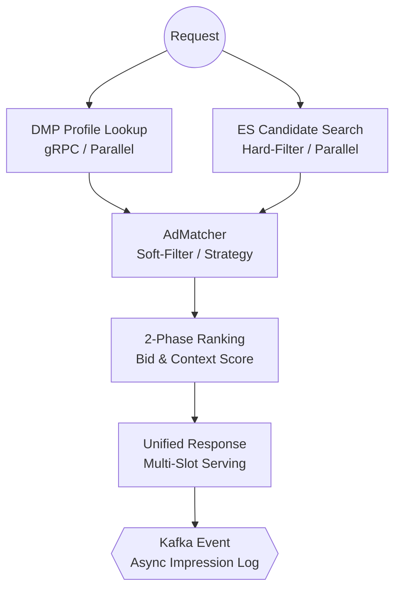

# Ad Server Engine

본 프로젝트는 다양한 광고 지면(무신사, 당근, 오늘의집 등)의 서빙 양태를 심층 분석하고, **"실제 서비스라면 어떻게 설계되었을 것인가"** 혹은 **"더 나은 설계는 무엇인가"**를 추론하여 구현한 고성능 광고 서빙 엔진입니다.

단순한 기능 구현을 넘어, 초고하중 트래픽 환경에서 **저지연(Low Latency)**과 **고가용성(High Availability)**을 확보하기 위한 백엔드 설계 철학을 담고 있습니다.

> **더 깊은 기술적 분석과 설계 고민은 하단의 [Technical Deep Dive] 블로그 시리즈에서 확인하실 수 있습니다.**
> 
> 실전 서비스 기반의 설계 근거부터, Java 21 가상 스레드를 활용한 병렬 처리 및 성능 최적화가 어떤 고민 끝에 구현되었는지 상세히 다룹니다.

---

## 🚀 Key Architectural Decisions

### 1. Speculative Candidate Loading (투기적 후보 로딩)
유저 프로필 조회(DMP)와 광고 후보군 추출(Elasticsearch)을 병렬로 실행하는 **Multi-Stage Pipeline**을 구축했습니다.
- **Java 21 Virtual Threads**: I/O 대기 구간에서 OS 스레드를 점유하지 않고 양보(Yield)하여, 수천 개의 동시 요청을 초경량 병렬 처리합니다.
- **Latency Hiding**: 가장 느린 연산 하나만큼의 시간으로 전체 서빙 프로세스를 완수합니다.

### 2. High-Performance Hybrid Filtering
광고 매칭의 정확도와 속도를 동시에 잡기 위한 2단계 필터링 전략을 채택했습니다.
- **Hard-Filter (DB/ES Layer)**: 성별, 계층형 지역 ID(1:11), 핵심 태그 등 정형화된 조건을 최상단에서 고속 검증합니다.
- **Soft-Filter (Application Layer)**: 가변적인 나이 범위, 유저 취향 가중치 등 복잡한 로직을 JSON(`target_context`) 기반의 전략 패턴으로 정밀 매칭합니다.

### 3. E-commerce Specialized 2-Layer Domain Model
불필요한 캠페인/광고그룹 계층을 배제하고 **광고주-광고(Advertiser-Ad)**의 직관적인 2계층 구조로 단순화하여 객체 로딩 및 변환 비용을 최소화했습니다.

---

## 🏗️ Serving Pipeline Architecture



---

## 📚 Technical Deep Dive (Analysis & Design)

본 프로젝트의 설계 근거와 기술적 고민은 아래 **기술 블로그(Velog)** 시리즈에서 상세히 다루고 있습니다.

- **Vol 1.** [서비스 분석: 당근, 무신사, 오늘의집 광고 설계 근거를 찾다](https://velog.io/@hoonyl/1.-%EB%8B%B9%EA%B7%BC-%EB%AC%B4%EC%8B%A0%EC%82%AC-%EC%98%A4%EB%8A%98%EC%9D%98%EC%A7%91-%EA%B4%91%EA%B3%A0%EB%A5%BC-%EC%A7%81%EC%A0%91-%EB%B6%84%EC%84%9D%ED%95%98%EB%A9%B0-%EC%84%A4%EA%B3%84%EC%9D%98-%EA%B7%BC%EA%B1%B0%EB%A5%BC-%EC%B0%BE%EB%8B%A4)
- **Vol 2-1.** [데이터 모델링: 고성능 서빙을 위한 2계층 도메인 설계](https://velog.io/@hoonyl/2-1.-%EA%B3%A0%EC%84%B1%EB%8A%A5-%EC%84%9C%EB%B9%99%EC%9D%84-%EC%9C%84%ED%95%9C-%EB%8D%B0%EC%9D%B4%ED%84%B0-%EB%AA%A8%EB%8D%B8%EB%A7%81)
- **Vol 2-2.** [실행 구조: 서빙 속도를 극한으로 끌어올리는 병렬 파이프라인](https://velog.io/@hoonyl/2-2.-%EC%84%9C%EB%B9%99-%EC%86%8D%EB%8F%84%EB%A5%BC-%EB%81%8C%EC%96%B4%EC%98%AC%EB%A6%AC%EB%8A%94-%EC%8B%A4%ED%96%89-%EA%B5%AC%EC%A1%B0)

---

## 🛠 Tech Stack

- **Core**: Java 21 (Virtual Threads), Spring Boot 3.4.0
- **Persistence**: MySQL 8.0, Redis (Caching/Budget Control)
- **Search Engine**: Elasticsearch 8.15.0
- **Communication**: gRPC (Protobuf 3) for DMP Integration
- **Infrastructure**: Apache Kafka 3.8.0 (KRaft), Docker Compose
- **Build**: Gradle, MapStruct, QueryDSL

---

## ⚡ Quick Start

### 1. 인프라 기동
```powershell
docker-compose up -d
```
MySQL, Redis, Kafka, Elasticsearch가 컨테이너 환경에서 즉시 구성됩니다.

### 2. 샘플 데이터 로딩
애플리케이션 기동 시 `src/main/resources/data.sql`이 자동 실행되어 **무신사, 당근마켓, 오늘의집 등 160여 건의 실전 광고 샘플 데이터**가 적재됩니다.

### 3. 대량 데이터 테스트
```powershell
python generate_ads.py
```
위 스크립트를 통해 수만 건 규모의 벌크 데이터를 생성하여 성능 벤치마크를 수행할 수 있습니다.