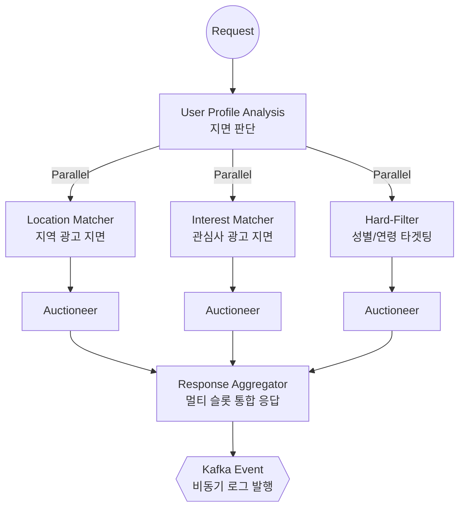

# Ad Server Engine

본 프로젝트는 다양한 광고 지면(무신사, 당근, 오늘의집 등)의 서빙 양태를 심층 분석하고, **"실제 서비스라면 어떻게 설계되었을 것인가"** 혹은 **"더 나은 설계는 무엇인가"**를 추론하여 구현한 포트폴리오입니다.

단순한 기능 구현을 넘어, 고밀도 트래픽 환경에서 **고가용성(High Availability)**과 **저지연(Low Latency)**을 확보하기 위한 백엔드 설계 철학을 담고 있습니다.

## 🚀 Key Features

분석된 서비스들의 실전적 전략을 반영한 **Multi-Stage Pipeline** 구조를 채택하였습니다.

- **Hard-Filter Layer**: (무신사 사례 반영) 성별, 연령 등 유저 프로필 기반의 절대적 제약 조건을 시스템 최상단에서 검증하여 도메인 무결성 보호
- **Path-based Location Matcher**: (당근 사례 반영) 계층형 지역 ID(Neighborhood ID) 체계를 활용하여, 지역 기반의 고속 매칭 수행
- **Interest-based Matcher**: (오늘의집 사례 반영) 유저의 관심사 및 과거 구매 내역을 바탕으로 최적의 광고 소재를 매칭하는 로직 구현
## 🏗️ Serving Pipeline Architecture (v0.1 초안)

본 엔진은 **한 번의 요청으로 여러 광고 지면(Slot)을 동시에 채워주는** 병렬 처리 깔때기(Parallel Funnel) 구조를 지향합니다.

- **Efficiency**: Java 21 **Virtual Threads**를 활용하여 각 지면별 매칭 연산을 초경량 병렬 처리
- **Low Latency**: 가장 느린 연산 하나만큼의 시간으로 모든 지면(Slot) 광고를 즉각 서빙

## 🛠 Tech Stack

- **Framework**: Java 21, Spring Boot 3.3.4
- **Persistence**: Spring Data JPA (Hibernate), MySQL 8.x, Redis
- **Infra & Messaging**: Apache Kafka (KRaft), Docker, Docker Compose
- **Build & Management**: Gradle (Groovy), Lombok, MapStruct